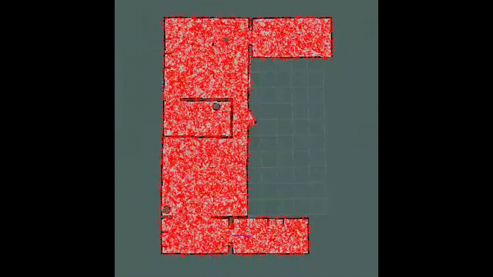

# particle_filter_localization_project
## Team Members
Sophie Veys,
Josephine Passananti
## Plans
* *How you will initialize your particle cloud (initialize_particle_cloud)?*
    * We will create a 2D array to hold the particle locations and their weights. We will chose the particles with equal distribution across the map. To test this, we can visually inspect via the GUI, we can check to ensure that the 2D array has no null values, or we could spot check particular indices. 
* *How you will update the position of the particles will be updated based on the movements of the robot(update_particles_with_motion_model)?*
    * When the robot moves we will move each particle the same distance and update their locations in the array.We will select a few particles for testing, and manually compute the expected final positions. Then, we will run the code and print the initial and final positions to ensure they match. 
* *How you will compute the importance weights of each particle after receiving the robot's laser scan data?(update_particle_weights_with_measurement_model)?*
    * We will use the Monty Carlo algorithm with the sensor data from our robot to compute the new weights of each particle. Again, we can test by selecting a few particles and manually computing the weights, then checking to ensure our code yields the same results. 
* *How you will normalize the particles' importance weights (normalize_particles) and resample the particles (resample_particles)?*
    * First we will normalize the particles' weights by adding them and computing the proportion of each one to the total. We will then resample particles by keeping the particles with the most significant weights and cloning particles with respect to their proportion. We can test by manually computing the normalized weights and comparing the results of our code, plus ensuring that the weights sum to 1. We will do this in the draw_random_sample() function. We can also evaluate our resampling function to see how well our chosen threshhold performs, specifcally what percentage of particles are kept. 
* *How you will update the estimated pose of the robot (update_estimated_robot_pose)?*
    * We will use our resampled particle distribution with the current estimated pose of the robot to update our belief of where the robot is. As we eliminate particles with low probability of being near the robot's actual position, we can choose new, weighted estimates for the robot's position. We can test this via visual inspection and then compare with the estimate our code gives. 
* *How you will incorporate noise into your particle filter localization?*
    * We will shift particles slightly to add 'noise' to our environments and resample our particle cloud each time. We will add noise in each of the four directions. This will help us gain a better idea of where our robot is without having to move the robot itself. We will add the same amount of noise to the robot. We can test this by spot checking and printing the locations and the noise to ensure reasonable values. We can also visually inspect to see if adding noise makes a difference in the proximity of the particle cloud to the robot. 
## Timeline
We will work on initializing our particle cloud and updating our particles location and weights based on robot movement over the next few days and try to be done by the end of this weekend. We will work on resampling, updating robot location, and adding noise early next week. Hopefully we will have the remainder of the week to work on debugging and optimization.

## WriteUp 

*Objectives description*  The goal of this project was to pinpoint the location of the turtlebot via the monte carlo localization method. Ideally, we want the particle cloud to be very close to the robot and to continue to follow the robot as it moves.    

*High level description*  We first needed to pick a random sample of particles that evenly covered the possible locations of the robot. We compared the particles' distances from nearby objects to the robot's sensor readings. We picked particles that had relatively high probabilities of being near the robot based on the similarity of the reading. Throughout this process, we updated our belief of where the robot is actually located by taking a fair average of the particles' positions, which represents our current best guess. Additionally, we added noise to the particles' position to counteract imprecise readings. This method eventually resulted in the particles converging around the robot's location.      

*Main steps*    
1. Initialization of particle cloud     
*Code location* This happens in the init and the initialize_particle_cloud functions.     
*Functions/code description* In the initialize_particle_cloud function, we first eliminate from consideration any particles that are a) outside of the room or b) occupied by another object (wall, table, etc.) according to the occupancy grid. We then select a random sample of valid particles. Finally, we compute the (x,y) location of these randomly-chosen particles based on its index in the occupancy grid (see helper function convert_to_real_coords), select a randomly-chosen orientation in the interval (0, 2*pi), and package these values into the particle pose structs with the weights all set to 1.0. This method produces an even distribution of particles across the possibility space of the robot, since at the beginning, the only thing we know about the robot's location is that it is in the house and not in a position occupied by another object.   
2. Movement model     
*Code location* This happens in the update_particles_with_motion_model function.       
*Functions/code description* In the update_particles_with_motion_model function, we compute how much the robot has moved by subtracting its former position/orientation from its current position/orientation. We compute the distance that it moved using the pythagorean theorem. We then move each of the particles (relative to their orientation) by this distance using the formula for rotation of a point about an origin. Since we are trying to locate the robot by guessing its location via particles, we need to move the particles the same way the robot has moved (with some noise, see section #5) so that we can best evaluate our guess.           
3. Measurement model    
*Code location* This happens in the update_particle_weights_with_measurement_model function.    
*Functions/code description*  In the update_particle_weights_with_measurement_model function, we compute the probability of each particle being approximately at the robot's position by comparing the similarity of the robot's sensor readings for nearby objects and the particles' proximity to nearby objects at a subset of the angles in the unit circle. We use the Gaussian function as demonstrated in class, with a few additional angles in the subset for increased accuracy while ensuring that our runtime is sufficiently fast. We update the weights of the particles based on this computation, which allows our weighted resampling function to pick more particles with higher likelihood of being near the robot.    
4. Resampling     
*Code location* This happens in the draw_random_sample and resample_particles functions.     
*Functions/code description* The resample_particles function calls the draw_random_sample function. The draw_random_sample function takes the particle_cloud, the weights of each particle, and the number of particles we want in our new sample. We use the numpy cumulative sum function to select a weighted sample of the same size (with replacement) based on the probability list. This helps us narrow down our search for the robot by selecting more particles that have relatively high probability of being near the robot.    
5. Incorporation of noise     
*Code location* This happens in the update_particles_with_motion_model function. 
*Functions/code description* We include noise in the updated particle positions and orientations by adding a random number generated from the normal distribution in order to counteract the imprecision of the robot's readings and motor control. This helps ensure variety in our particle samples and prevents us from zeroing in on inaccurate locations.    
6. Updating estimated robot pose    
*code location* This happens in the update_estimated_robot_pose function.    
*Functions/code description* In update_estimated_robot_pose, we compute our new best guess for the robot's actual position by taking a fair average of the position/orientation components. We update the robot's estimated position and orientation with these values. When implemented correctly, this function allows us to visually inspect that the estimated robot position is congruent with the actual robot position in the particle viewer.     
7. Optimization of parameters   
*code location* The main place we ended up optimizing was in update_particles_with_motion_model. While we played around with values in other locations update_particle_weights_with_measurement_model, we did not end up changing from the default values due to runtime trade-offs.     
*Functions/code description* We experimented with different noise values until we found a value that worked well, as evaluated by visual inspection of the accuracy and spread of the particle cloud around the robot. Note that we also tried adjusting the standard deviation in the Gaussian probability function. This did not seem to help so we changed it back to the default of 1. We also tried adding more directions in update_particle_weights_with_measurement_model, but we experienced errors due to the runtime being too long relative to the speed of the robot and the update intervals.     

## Challenges     
The most challenging part of this assignment was debugging. There were several components involved in the particle filter, and it was difficult to find out which function was responsible for unexpected behavior. We debugged by going through each function and performing internal tests. We also reduced the number of particles to 4 so that we could better observe what was going on. For instance, when we were debugging our motion model, it was easier to track how our particles changed their positions in response to movement of the robot. It was also difficult to know whether hard-coded values were responsible for bugs. For instance, we had to pick values for the standard deviation of the Gaussian probability function and for noise. It was hard to know if bugs were due to these values being off or due to larger flaws in our code. The only solution here was trial and error.   

## Future Work    
If given more time, we could play around with the accuracy vs. runtime trade-off that we discussed in section #7 (Optimization of parameters). We could continue adjusting the number of particles, noise, standard deviation, and number of directions until we found a combination that pinpointed the robot's location with better accuracy without exceeding our runtime constraints. We might also create a more formal testing suite and some metric for evaluating accuracy besides visual inspection such that we could better evaluate the effects of changing the parameters mentioned.   

## Takeaways    
*Include testing interfaces in code design*  It was very frustrating to try to debug this project. We would probably have saved a lot of time if we had included test points from the beginning rather than relying on print statements, visual inspection, and trial and error. We would recommend making simple test cases based on manual computation and checking the program's behavior against these.    
*Learn how to use git merge* We were terrified of merge conflicts so we developed a system that circumvented using merge. We feel that our work flow would have been better if we took the time to figure out how to use git merge.    
*Start with the simple case* As suggested by the course staff, it is best to debug by examining the smaller, simpler cases. For example, we were able to observe parts of our program better when we reduced the number of particles from 10000 to 4.   

